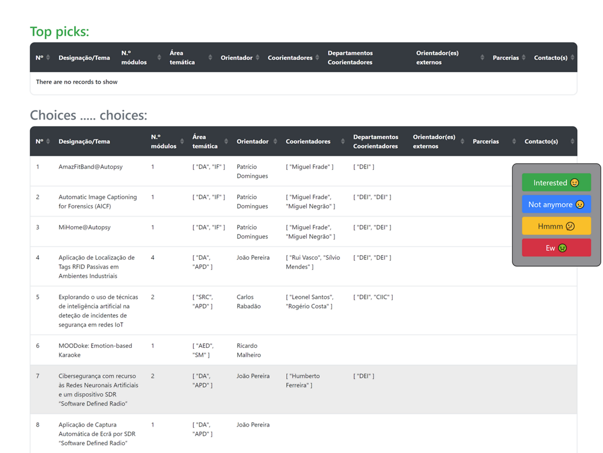
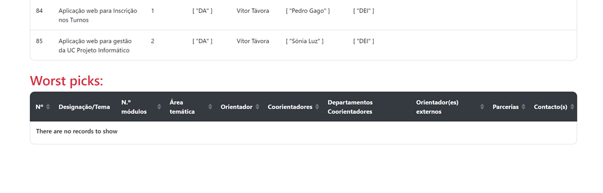

# ProposalsPI

Simple single page application I developed using Nuxt.js to aid in choosing a capstone project from the provided list which was in a pdf file.

## Build Setup

```bash
# install dependencies
$ npm install

# serve with hot reload at localhost:3000
$ npm run dev

# build for production and launch server
$ npm run build
$ npm run start

# generate static project
$ npm run generate
```



<p align="center">
    <code>
    ...
    </code>
</p>

